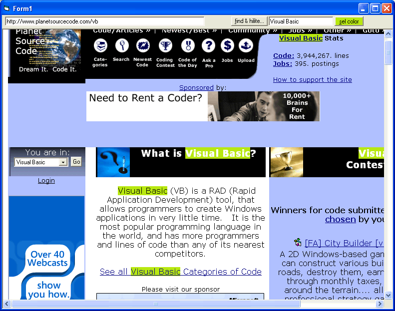



## HTML tutorial series  \# 2::: How to find and Hilite words in a webpage \(like \.PDF\)

### Description

This a thoroughly comment..easy to understand, and , yet, amazing example of the power the HTML object library has. This particular example with show you how you can find, and hilight (any color you wish) words in a web page
 
### More Info
 

             |
---                |---
**Submitted On**   |2005-01-28 00:57:58
**By**             |[Evan Toder](https://github.com/Planet-Source-Code/PSCIndex/blob/master/ByAuthor/evan-toder.md)
**Level**          |Intermediate
**User Rating**    |5.0 (15 globes from 3 users)
**Compatibility**  |VB 3\.0, VB 4\.0 \(16\-bit\), VB 4\.0 \(32\-bit\), VB 5\.0, VB 6\.0
**Category**       |[Coding Standards](https://github.com/Planet-Source-Code/PSCIndex/blob/master/ByCategory/coding-standards__1-43.md)
**World**          |[Visual Basic](https://github.com/Planet-Source-Code/PSCIndex/blob/master/ByWorld/visual-basic.md)
**Archive File**   |[HTML\_tutor1844901282005\.zip](https://github.com/Planet-Source-Code/evan-toder-html-tutorial-series-2-how-to-find-and-hilite-words-in-a-webpage-like-pdf__1-58534/archive/master.zip)

